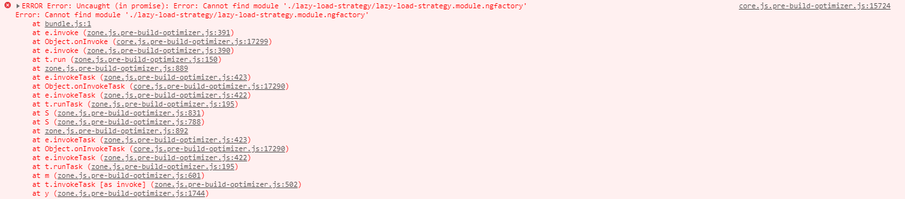

# Angular Compiler Issue

This project was generated to demonstrate an issue in Angular Compiler when you use Custom Elements

For building this project it's necessary running the following steps:

Prepare the static server

* `cd static`
* `npm install`
* `npm start`

Prepare application

* `cd compiler-issue`
* `npm install`
* `npm run package:custom-element-a`
* `npm run start-prod`

## Project structure

This workspace is divided into two projects.

* main-app is an application that is responsible for running the custom element.
* custom-element-a is an application that exposes a custom element `<custom-element-a>`.

## Problem 1/2 - Lazy load ngfactory problem

When the application `main-app` is built using production mode, and the application `custom-element-a` is built using production mode (optimization=true).
When accessing the route `/lazy-load-strategy` the following error has thrown.

When you build the `custom-element-a` with `--optimization=false` the `main-app` works in production mode, but doesn't work in dev-mode. (`npm run package-prod:custom-element-a`).

When you build the `custom-element-a` with `--optimization=true` the `main-app` doesn't work in production mode, but works in dev-mode. (`npm run package:custom-element-a`)

## Problem 2/2 - The Custom element doesn't render (route withut lazy load)

When the application `main-app` is built using production mode, and the application `custom-element-a` is built using production mode (optimization=true).
When accessing the route `/normal-strategy` the custom-element doesn't renderer.

In the custom-element-a component, the lifecycle OnInit execute a console.log message, but in this case, the message isn't printed.

When you build the `custom-element-a` with `--optimization=false` the `main-app` works in production mode, but doesn't work in dev-mode. (`npm run package-prod:custom-element-a`)

When you build the `custom-element-a` with `--optimization=true` the `main-app` doesn't work in production mode, but works in dev-mode. (`npm run package:custom-element-a`)
